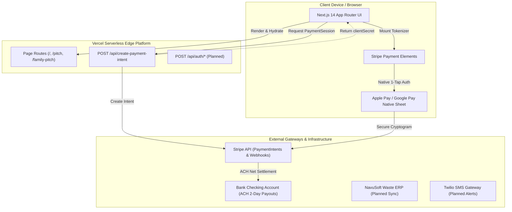

# ARCHITECTURE.md — System Architecture & Technical Blueprint

> **System Overview:** Suburban Waste Services (SWS) Customer Self-Service Portal & 1-Tap Bill Payment platform. Built to modernize municipal and private waste utility billing with zero-friction mobile payments, automated route reminders, and self-service container management.

---

## 1. System Topology

---

## 2. Component Taxonomy

### Application Routes (`src/app/`)
* **`src/app/page.tsx`**: Primary customer portal interface. Houses customer account summary, current balance, route pickup schedule, service history, and container manager modal triggers.
* **`src/app/pitch/page.tsx`**: Operational and commercial transformation pitch deck for municipal and enterprise haulers.
* **`src/app/family-pitch/page.tsx`**: Strategic expansion thesis detailing school bus micro-payments and healthcare MedPay (1-tap HSA/FSA medical billing).
* **`src/app/api/create-payment-intent/route.ts`**: Serverless route handler. Initializes Stripe, creates PaymentIntent for invoice amount, and manages fallback for unconfigured environments.

### Core Components (`src/components/`)
* **`PaymentModal.tsx`**: High-conversion payment modal. Automatically detects user device (iOS vs. Android), checks Stripe engine configuration, and renders either `StripeLivePayment` or high-fidelity simulated checkout with confetti.
* **`StripeLivePayment.tsx`**: Stripe Payment Request component. Mounts `PaymentRequestButtonElement`, verifies hardware wallet availability via `canMakePayment()`, and executes live authorization.
* **`AccountSummary.tsx`**: Displays current billing cycle, due date, invoice breakdown, and 1-tap "Pay Balance" CTA.
* **`ServiceSchedule.tsx`**: Next collection countdown, trash vs. recycling calendar flags, and delay notices (e.g. holiday route shifts).
* **`CalendarSyncModal.tsx`**: Dynamic `.ics` generation for Apple Calendar, Google Calendar, and Outlook pickup reminders.
* **`ContainerManagerModal.tsx`**: Customer cart manager (request second recycling bin, request damaged lid repair).
* **`ExtraServiceModal.tsx`**: Bulky item pickup requests (appliances, mattresses, yard waste overages).
* **`SmsRecoveryModal.tsx`**: Passwordless phone number lookup and SMS PIN verification.

### Shared Libraries (`src/lib/`)
* **`stripe.ts`**: Client-side singleton loader for Stripe.js (`getStripe()`).
* **`icsGenerator.ts`**: RFC 5545 compliant `.ics` calendar file generator for recurring waste pickup schedules.
* **`mockData.ts`**: Strongly-typed customer profiles, service schedules, and account ledgers.

---

## 3. Payment Processing Architecture

### End-to-End Payment Flow
1. **Invoice Presentation:** Customer views invoice balance ($94.50) in `AccountSummary.tsx` and clicks "Pay Balance".
2. **Intent Creation:** `PaymentModal` opens and posts `{ amount: 94.50 }` to `/api/create-payment-intent`.
3. **Session Initialization:** Next.js serverless route interacts with `stripe.paymentIntents.create()` and returns a scoped `clientSecret`.
4. **Wallet Detection:** Client checks `stripe.paymentRequest().canMakePayment()`.
   * **If wallet detected (Google Pay / Apple Pay):** Native sheet appears immediately.
   * **If no wallet or test fallback:** Modal renders high-fidelity 1-tap demo buttons with clear status indicators.
5. **Authorization & Confirmation:** The customer authorizes using Face ID, Touch ID, or Google Pay fingerprint. Stripe confirms the charge client-side.
6. **Clearing & Celebration:** On success, the UI fires celebratory canvas confetti, displays an instant receipt confirmation, and marks the account balance as paid in state.
7. **Funds Settlement:** Stripe clears funds via card network rails and deposits net payout into the linked business bank account.

---

## 4. PCI-DSS Compliance & Security Blueprint

* **SAQ A Eligibility:** By utilizing Stripe Elements and browser native payment request buttons, all sensitive card data is sent directly to Stripe's Level 1 PCI-compliant vault.
* **Zero Server Contact:** Primary Account Numbers (PANs), CVVs, and magnetic stripe data never traverse our Next.js serverless functions.
* **Environment Variable Governance:**
  * Client: `NEXT_PUBLIC_STRIPE_PUBLISHABLE_KEY` (public, safe).
  * Server: `STRIPE_SECRET_KEY` (stored exclusively in Vercel Encrypted Secrets).
