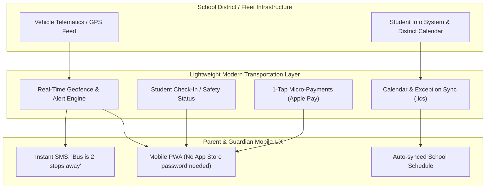

# Venture Expansion Ideas & Adjacent Verticals Appendix

This appendix documents high-potential adjacent markets and expansion verticals that leverage the exact same core software architecture developed for the **SWS Waste Customer Portal**: *a lightweight, mobile-first parent/resident communication and 1-tap payment layer sitting atop legacy dispatch/routing ERPs.*

---

## 1. Primary Expansion: K-12 School Bus & Transportation Portal

### The Core Problem & Parallels
* **The "Where is the Bus?" Panic:** School administration desks and district transportation dispatchers receive hundreds of frantic inbound phone calls every morning and afternoon (*"Where is bus #14?", "Did my kid miss the bus?", "Is the bus running late in the snow?"*). This is the exact equivalent of residential waste calls (*"Why was my bin skipped?"*).
* **Legacy Back-Office Lock-in:** School districts rely on legacy routing engines (e.g., Transfinder, Versatrans, Edulog, Zonar/Samsara GPS) that manage driver routes, state compliance, and bus assignments well, but offer terrible or nonexistent parent-facing mobile experiences.
* **Low Parent Satisfaction with Current Tools:** Incumbent solutions like *Here Comes the Bus* or *FirstView* suffer from legacy codebases, delayed GPS sync, and consistently poor app store ratings (1.5–2.5 stars).

---

### Key Feature Modules

1. **Smart Geofenced ETA & Curbside SMS Alerts:**
   * *"Bus #14 is 3 stops away (~5 mins). Time to head to the corner."*
   * Prevents students from standing outside in sub-zero Minnesota winters or heavy rain.
2. **Dynamic District Calendar & Exception Handling:**
   * Automated `.ics` calendar sync for dynamic school schedules: 2-hour weather delays, Late-Start Wednesdays, A/B rotation days, early releases, and snow makeup days.
3. **Frictionless Parent "No-Show" Logging:**
   * One-tap parent button: *"Leo is not riding the morning bus today (parent driving)."*
   * Drivers save 1–2 minutes per stop by not waiting at empty corners, keeping whole routes on time.
4. **Student Boarding & Safety Confirmation:**
   * Real-time notifications: *"Leo boarded Bus #14 at 7:22 AM"* / *"Leo safely arrived at Eden Prairie Middle School at 7:46 AM."*
5. **Micro-Payments & Fee Collection:**
   * **Pay-to-Ride / Courtesy Busing:** Automated recurring fee collection for families living within 1–2 miles of school.
   * **Activity Buses & Field Trips:** 1-tap Apple Pay/Google Pay checkout for after-school sports transport or field trip transportation fees.

---

### Target Go-To-Market & Beachhead

1. **Private & Independent Schools (Fastest Sales Cycle):**
   * High willingness to pay to provide a premium, white-glove parent experience without district bureaucracy or lengthy RFP cycles.
2. **Contracted School Bus Fleets (Regional Bus Operators):**
   * Family-owned or regional transportation contractors (e.g., Durham, regional First Student contractors) looking to differentiate themselves to win district contracts.
3. **Suburban Public School Districts:**
   * Focus on transportation directors actively trying to reduce morning front-desk call load.

---

## 2. Additional Adjacent Verticals

| Vertical | Core Pain Point | Overlay Solution | Revenue Model |
| :--- | :--- | :--- | :--- |
| **Residential Snow Plowing** | Homeowners calling *"When will my driveway be plowed?"* during storms. | Live storm dispatch tracker + "Plow is 3 houses away" SMS. | Seasonal SaaS subscription + per-plow transaction fee. |
| **Municipal Street Sweeping & Leaf Pickup** | Citizens parked on streets during sweeping days getting tickets or missed. | Interactive street schedule + SMS calendar alerts (*"Move cars by 7 AM"*). | City / Public Works annual software contract. |
| **Septic & Bulk Water Delivery** | High missed appointments and check-in-the-mail billing delays. | Automated interval reminders, 1-tap Apple Pay pre-authorizations. | Per-route monthly fee + payment processing take-rate. |

---

## 3. Technology Reusability Score: 90%+
* **Shared Front-End:** Next.js PWA, Framer Motion, Tailwind CSS, 1-Tap Payment Modals, Dynamic Calendar Sync (`.ics` generation).
* **Shared Notification Engine:** SMS webhooks (Twilio), geofenced ETA triggers, status recovery flows.
* **Shared Zero-Friction Auth:** Phone number + SMS magic token onboarding (zero passwords).
